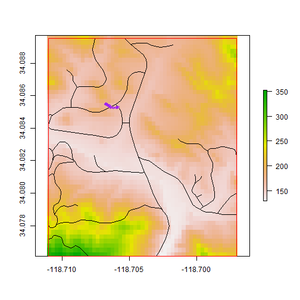
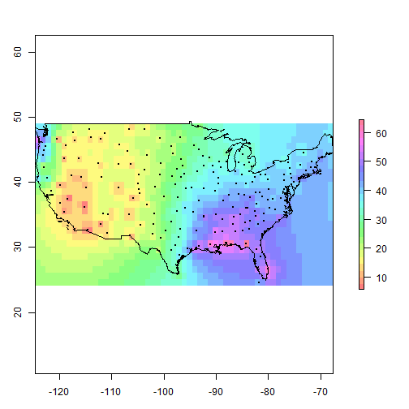

GIS IN R - Introduction to GIS (Section 2)
========================================================

Here are some of the stuff we learned in Introduction to GIS course.
GIS is probably better for data collection, data manipulation/editting,
and creating a visually pleasing map layout. But, R might be a good 
option for sharing & publishing your analysis, including both processes 
and results.


```r
# what does a package do?  library(help = 'sp') help(package = 'sp')
# packageDescription('sp')

# get ready for doing something spatial - by installing packages/libraries
# install.packages('rgdal') install.packages('spdep')
# install.packages('maptools') install.packages('raster')
library(rgdal)
library(maptools)
library(spdep)
library(raster)

# change the fowlling working directory accordingly
setwd("F:/Geog_Intro2GIS/2013/Misc/R")

# download and unzip the exercise data
download.file("http://home.uchicago.edu/~cmaene/data.zip", destfile = "data.zip")
unzip("data.zip")
setwd("data")

##### MAPPING POINTS, LINES, POLYGONS & RASTER ALL AT ONCE #####

# read (upload) data
roads <- readShapeSpatial("roads.shp")

# what exactly did we do?
help(readShapeSpatial)

# take a look at the spatial object
class(roads)
```

```
## [1] "SpatialLinesDataFrame"
## attr(,"package")
## [1] "sp"
```

```r
summary(roads)  # data summary
```

```
## Object of class SpatialLinesDataFrame
## Coordinates:
##       min     max
## x -118.71 -118.70
## y   34.08   34.09
## Is projected: NA 
## proj4string : [NA]
## Data attributes:
##     L_F_ADD         L_T_ADD         R_F_ADD         R_T_ADD       PREFIX  
##  Min.   :    0   Min.   :    0   Min.   :    0   Min.   :    0   NA's:55  
##  1st Qu.:    0   1st Qu.:    0   1st Qu.:    0   1st Qu.:    0            
##  Median :    0   Median :    0   Median :    0   Median :    0            
##  Mean   : 4057   Mean   : 4067   Mean   : 3590   Mean   : 3601            
##  3rd Qu.:  780   3rd Qu.:  898   3rd Qu.:  732   3rd Qu.:  830            
##  Max.   :26899   Max.   :26793   Max.   :26898   Max.   :26792            
##                                                                           
##  PRETYPE               NAME      TYPE     SUFFIX   CLASS_RTE RAMP_CLASS
##  NA's:55   Dorothy       : 8   Dr  :15   NA's:55   3:13      NA's:55   
##            Malibu Canyon : 8   Rd  :20             4:42                
##            Las Virgenes  : 7   Way : 1                                 
##            Mesa Peak Mtwy: 6   NA's:19                                 
##            Piuma         : 4                                           
##            (Other)       : 9                                           
##            NA's          :13                                           
##    FROM_ELEV    TO_ELEV  HWY_TYPE  HWY_SYMBOL   SPEED_MPH    PREFIX1  
##  Min.   :0   Min.   :0   NA's:55   NA's:55    Min.   :25.0   NA's:55  
##  1st Qu.:0   1st Qu.:0                        1st Qu.:25.0            
##  Median :0   Median :0                        Median :25.0            
##  Mean   :0   Mean   :0                        Mean   :27.4            
##  3rd Qu.:0   3rd Qu.:0                        3rd Qu.:25.0            
##  Max.   :0   Max.   :0                        Max.   :35.0            
##                                                                       
##  PRETYPE1           NAME1     TYPE1    SUFFIX1   PREFIX2   PRETYPE2 
##  CORD:15   Coral Canyon: 6   Rd  : 6   NA's:55   NA's:55   NA's:55  
##  NA's:40   N1          :15   NA's:49                                
##            NA's        :34                                          
##                                                                     
##                                                                     
##                                                                     
##                                                                     
##   NAME2     TYPE2    SUFFIX2   PREFIX3   PRETYPE3   NAME3     TYPE3   
##  NA's:55   NA's:55   NA's:55   NA's:55   NA's:55   NA's:55   NA's:55  
##                                                                       
##                                                                       
##                                                                       
##                                                                       
##                                                                       
##                                                                       
##  SUFFIX3   PREFIX4   PRETYPE4   NAME4     TYPE4    SUFFIX4     ZIP_L   
##  NA's:55   NA's:55   NA's:55   NA's:55   NA's:55   NA's:55   90265:21  
##                                                              91302:34  
##                                                                        
##                                                                        
##                                                                        
##                                                                        
##                                                                        
##    ZIP_R        GEONAME_L      GEONAME_R  STATE_L STATE_R        STATE   
##  90265:19   Calabasas:34   Calabasas:36   CA:55   CA:55   California:55  
##  91302:36   Malibu   :21   Malibu   :19                                  
##                                                                          
##                                                                          
##                                                                          
##                                                                          
## 
```

```r
plot(roads)  # look at the spatial object graphically
```

 

```r
dim(roads)  # check the number of obsevations & variables
```

```
## [1] 55 43
```

```r
names(roads)  # variable names
```

```
##  [1] "L_F_ADD"    "L_T_ADD"    "R_F_ADD"    "R_T_ADD"    "PREFIX"    
##  [6] "PRETYPE"    "NAME"       "TYPE"       "SUFFIX"     "CLASS_RTE" 
## [11] "RAMP_CLASS" "FROM_ELEV"  "TO_ELEV"    "HWY_TYPE"   "HWY_SYMBOL"
## [16] "SPEED_MPH"  "PREFIX1"    "PRETYPE1"   "NAME1"      "TYPE1"     
## [21] "SUFFIX1"    "PREFIX2"    "PRETYPE2"   "NAME2"      "TYPE2"     
## [26] "SUFFIX2"    "PREFIX3"    "PRETYPE3"   "NAME3"      "TYPE3"     
## [31] "SUFFIX3"    "PREFIX4"    "PRETYPE4"   "NAME4"      "TYPE4"     
## [36] "SUFFIX4"    "ZIP_L"      "ZIP_R"      "GEONAME_L"  "GEONAME_R" 
## [41] "STATE_L"    "STATE_R"    "STATE"
```

```r
head(roads)  # view the first 6 observations
```

```
##   L_F_ADD L_T_ADD R_F_ADD R_T_ADD PREFIX PRETYPE  NAME TYPE SUFFIX
## 0   25836   25898   25801   25899   <NA>    <NA> Piuma   Rd   <NA>
## 1   25900   25902   25901   25999   <NA>    <NA> Piuma   Rd   <NA>
## 2       0       0       0       0   <NA>    <NA>  <NA> <NA>   <NA>
## 3       0       0       0       0   <NA>    <NA>  <NA> <NA>   <NA>
## 4       0       0       0       0   <NA>    <NA>  <NA> <NA>   <NA>
## 5       0       0       0       0   <NA>    <NA>  <NA> <NA>   <NA>
##   CLASS_RTE RAMP_CLASS FROM_ELEV TO_ELEV HWY_TYPE HWY_SYMBOL SPEED_MPH
## 0         4       <NA>         0       0     <NA>       <NA>        25
## 1         4       <NA>         0       0     <NA>       <NA>        25
## 2         4       <NA>         0       0     <NA>       <NA>        25
## 3         4       <NA>         0       0     <NA>       <NA>        25
## 4         4       <NA>         0       0     <NA>       <NA>        25
## 5         4       <NA>         0       0     <NA>       <NA>        25
##   PREFIX1 PRETYPE1 NAME1 TYPE1 SUFFIX1 PREFIX2 PRETYPE2 NAME2 TYPE2
## 0    <NA>     <NA>  <NA>  <NA>    <NA>    <NA>     <NA>  <NA>  <NA>
## 1    <NA>     <NA>  <NA>  <NA>    <NA>    <NA>     <NA>  <NA>  <NA>
## 2    <NA>     <NA>  <NA>  <NA>    <NA>    <NA>     <NA>  <NA>  <NA>
## 3    <NA>     <NA>  <NA>  <NA>    <NA>    <NA>     <NA>  <NA>  <NA>
## 4    <NA>     <NA>  <NA>  <NA>    <NA>    <NA>     <NA>  <NA>  <NA>
## 5    <NA>     <NA>  <NA>  <NA>    <NA>    <NA>     <NA>  <NA>  <NA>
##   SUFFIX2 PREFIX3 PRETYPE3 NAME3 TYPE3 SUFFIX3 PREFIX4 PRETYPE4 NAME4
## 0    <NA>    <NA>     <NA>  <NA>  <NA>    <NA>    <NA>     <NA>  <NA>
## 1    <NA>    <NA>     <NA>  <NA>  <NA>    <NA>    <NA>     <NA>  <NA>
## 2    <NA>    <NA>     <NA>  <NA>  <NA>    <NA>    <NA>     <NA>  <NA>
## 3    <NA>    <NA>     <NA>  <NA>  <NA>    <NA>    <NA>     <NA>  <NA>
## 4    <NA>    <NA>     <NA>  <NA>  <NA>    <NA>    <NA>     <NA>  <NA>
## 5    <NA>    <NA>     <NA>  <NA>  <NA>    <NA>    <NA>     <NA>  <NA>
##   TYPE4 SUFFIX4 ZIP_L ZIP_R GEONAME_L GEONAME_R STATE_L STATE_R      STATE
## 0  <NA>    <NA> 90265 91302    Malibu Calabasas      CA      CA California
## 1  <NA>    <NA> 90265 91302    Malibu Calabasas      CA      CA California
## 2  <NA>    <NA> 90265 90265    Malibu    Malibu      CA      CA California
## 3  <NA>    <NA> 90265 90265    Malibu    Malibu      CA      CA California
## 4  <NA>    <NA> 90265 90265    Malibu    Malibu      CA      CA California
## 5  <NA>    <NA> 90265 90265    Malibu    Malibu      CA      CA California
```

```r
tail(roads)  # view the last 6 observations
```

```
##    L_F_ADD L_T_ADD R_F_ADD R_T_ADD PREFIX PRETYPE                NAME TYPE
## 49     900     924     901     925   <NA>    <NA>        Las Virgenes   Rd
## 50     926    1098     927    1099   <NA>    <NA>        Las Virgenes   Rd
## 51       0       0       0       0   <NA>    <NA> Las Virgenes Canyon   Rd
## 52     619     601     618     600   <NA>    <NA>       Malibu Canyon   Rd
## 53   25904   25916       0       0   <NA>    <NA>               Piuma   Rd
## 54   25918   26030   26201   26299   <NA>    <NA>               Piuma   Rd
##    SUFFIX CLASS_RTE RAMP_CLASS FROM_ELEV TO_ELEV HWY_TYPE HWY_SYMBOL
## 49   <NA>         3       <NA>         0       0     <NA>       <NA>
## 50   <NA>         3       <NA>         0       0     <NA>       <NA>
## 51   <NA>         4       <NA>         0       0     <NA>       <NA>
## 52   <NA>         3       <NA>         0       0     <NA>       <NA>
## 53   <NA>         4       <NA>         0       0     <NA>       <NA>
## 54   <NA>         4       <NA>         0       0     <NA>       <NA>
##    SPEED_MPH PREFIX1 PRETYPE1 NAME1 TYPE1 SUFFIX1 PREFIX2 PRETYPE2 NAME2
## 49        35    <NA>     CORD    N1  <NA>    <NA>    <NA>     <NA>  <NA>
## 50        35    <NA>     CORD    N1  <NA>    <NA>    <NA>     <NA>  <NA>
## 51        25    <NA>     <NA>  <NA>  <NA>    <NA>    <NA>     <NA>  <NA>
## 52        35    <NA>     CORD    N1  <NA>    <NA>    <NA>     <NA>  <NA>
## 53        25    <NA>     <NA>  <NA>  <NA>    <NA>    <NA>     <NA>  <NA>
## 54        25    <NA>     <NA>  <NA>  <NA>    <NA>    <NA>     <NA>  <NA>
##    TYPE2 SUFFIX2 PREFIX3 PRETYPE3 NAME3 TYPE3 SUFFIX3 PREFIX4 PRETYPE4
## 49  <NA>    <NA>    <NA>     <NA>  <NA>  <NA>    <NA>    <NA>     <NA>
## 50  <NA>    <NA>    <NA>     <NA>  <NA>  <NA>    <NA>    <NA>     <NA>
## 51  <NA>    <NA>    <NA>     <NA>  <NA>  <NA>    <NA>    <NA>     <NA>
## 52  <NA>    <NA>    <NA>     <NA>  <NA>  <NA>    <NA>    <NA>     <NA>
## 53  <NA>    <NA>    <NA>     <NA>  <NA>  <NA>    <NA>    <NA>     <NA>
## 54  <NA>    <NA>    <NA>     <NA>  <NA>  <NA>    <NA>    <NA>     <NA>
##    NAME4 TYPE4 SUFFIX4 ZIP_L ZIP_R GEONAME_L GEONAME_R STATE_L STATE_R
## 49  <NA>  <NA>    <NA> 91302 91302 Calabasas Calabasas      CA      CA
## 50  <NA>  <NA>    <NA> 91302 91302 Calabasas Calabasas      CA      CA
## 51  <NA>  <NA>    <NA> 91302 91302 Calabasas Calabasas      CA      CA
## 52  <NA>  <NA>    <NA> 91302 91302 Calabasas Calabasas      CA      CA
## 53  <NA>  <NA>    <NA> 91302 91302 Calabasas Calabasas      CA      CA
## 54  <NA>  <NA>    <NA> 91302 91302 Calabasas Calabasas      CA      CA
##         STATE
## 49 California
## 50 California
## 51 California
## 52 California
## 53 California
## 54 California
```

```r
str(roads@data)
```

```
## 'data.frame':	55 obs. of  43 variables:
##  $ L_F_ADD   : int  25836 25900 0 0 0 0 0 0 0 0 ...
##  $ L_T_ADD   : int  25898 25902 0 0 0 0 0 0 0 0 ...
##  $ R_F_ADD   : int  25801 25901 0 0 0 0 0 0 0 0 ...
##  $ R_T_ADD   : int  25899 25999 0 0 0 0 0 0 0 0 ...
##  $ PREFIX    : Factor w/ 0 levels: NA NA NA NA NA NA NA NA NA NA ...
##  $ PRETYPE   : Factor w/ 0 levels: NA NA NA NA NA NA NA NA NA NA ...
##  $ NAME      : Factor w/ 10 levels "Crater Camp",..: 10 10 NA NA NA NA NA 7 7 7 ...
##  $ TYPE      : Factor w/ 3 levels "Dr","Rd","Way": 2 2 NA NA NA NA NA NA NA NA ...
##  $ SUFFIX    : Factor w/ 0 levels: NA NA NA NA NA NA NA NA NA NA ...
##  $ CLASS_RTE : Factor w/ 2 levels "3","4": 2 2 2 2 2 2 2 2 2 2 ...
##  $ RAMP_CLASS: Factor w/ 0 levels: NA NA NA NA NA NA NA NA NA NA ...
##  $ FROM_ELEV : int  0 0 0 0 0 0 0 0 0 0 ...
##  $ TO_ELEV   : int  0 0 0 0 0 0 0 0 0 0 ...
##  $ HWY_TYPE  : Factor w/ 0 levels: NA NA NA NA NA NA NA NA NA NA ...
##  $ HWY_SYMBOL: Factor w/ 0 levels: NA NA NA NA NA NA NA NA NA NA ...
##  $ SPEED_MPH : int  25 25 25 25 25 25 25 25 25 25 ...
##  $ PREFIX1   : Factor w/ 0 levels: NA NA NA NA NA NA NA NA NA NA ...
##  $ PRETYPE1  : Factor w/ 1 level "CORD": NA NA NA NA NA NA NA NA NA NA ...
##  $ NAME1     : Factor w/ 2 levels "Coral Canyon",..: NA NA NA NA NA NA NA 1 1 1 ...
##  $ TYPE1     : Factor w/ 1 level "Rd": NA NA NA NA NA NA NA 1 1 1 ...
##  $ SUFFIX1   : Factor w/ 0 levels: NA NA NA NA NA NA NA NA NA NA ...
##  $ PREFIX2   : Factor w/ 0 levels: NA NA NA NA NA NA NA NA NA NA ...
##  $ PRETYPE2  : Factor w/ 0 levels: NA NA NA NA NA NA NA NA NA NA ...
##  $ NAME2     : Factor w/ 0 levels: NA NA NA NA NA NA NA NA NA NA ...
##  $ TYPE2     : Factor w/ 0 levels: NA NA NA NA NA NA NA NA NA NA ...
##  $ SUFFIX2   : Factor w/ 0 levels: NA NA NA NA NA NA NA NA NA NA ...
##  $ PREFIX3   : Factor w/ 0 levels: NA NA NA NA NA NA NA NA NA NA ...
##  $ PRETYPE3  : Factor w/ 0 levels: NA NA NA NA NA NA NA NA NA NA ...
##  $ NAME3     : Factor w/ 0 levels: NA NA NA NA NA NA NA NA NA NA ...
##  $ TYPE3     : Factor w/ 0 levels: NA NA NA NA NA NA NA NA NA NA ...
##  $ SUFFIX3   : Factor w/ 0 levels: NA NA NA NA NA NA NA NA NA NA ...
##  $ PREFIX4   : Factor w/ 0 levels: NA NA NA NA NA NA NA NA NA NA ...
##  $ PRETYPE4  : Factor w/ 0 levels: NA NA NA NA NA NA NA NA NA NA ...
##  $ NAME4     : Factor w/ 0 levels: NA NA NA NA NA NA NA NA NA NA ...
##  $ TYPE4     : Factor w/ 0 levels: NA NA NA NA NA NA NA NA NA NA ...
##  $ SUFFIX4   : Factor w/ 0 levels: NA NA NA NA NA NA NA NA NA NA ...
##  $ ZIP_L     : Factor w/ 2 levels "90265","91302": 1 1 1 1 1 1 1 1 1 1 ...
##  $ ZIP_R     : Factor w/ 2 levels "90265","91302": 2 2 1 1 1 1 1 1 1 1 ...
##  $ GEONAME_L : Factor w/ 2 levels "Calabasas","Malibu": 2 2 2 2 2 2 2 2 2 2 ...
##  $ GEONAME_R : Factor w/ 2 levels "Calabasas","Malibu": 1 1 2 2 2 2 2 2 2 2 ...
##  $ STATE_L   : Factor w/ 1 level "CA": 1 1 1 1 1 1 1 1 1 1 ...
##  $ STATE_R   : Factor w/ 1 level "CA": 1 1 1 1 1 1 1 1 1 1 ...
##  $ STATE     : Factor w/ 1 level "California": 1 1 1 1 1 1 1 1 1 1 ...
##  - attr(*, "data_types")= chr  "N" "N" "N" "N" ...
```

```r

# add more data
studyarea <- readShapeSpatial("studyarea.shp")
elevation <- raster("elevation.asc")
lilac <- read.csv("LilacTreesGPS.csv", sep = ",")

# lay data over the elevation raster
plot(elevation)
lines(roads)
points(y = lilac$y, x = lilac$x, col = "purple", cex = 0.8)  # add the GPS points
plot(studyarea, border = "red", pch = 10, add = T)
```

 

```r

##### DATUM & PROJECTIONS #####

# read data
wgs84 <- CRS("+proj=longlat +ellps=WGS84 +datum=WGS84")
graticule <- readShapeSpatial("latlong.shp", proj4string = wgs84)
countries <- readShapeSpatial("country.shp", proj4string = wgs84)
cities <- readShapeSpatial("cities.shp", proj4string = wgs84)
route <- readShapeSpatial("route.shp", proj4string = wgs84)

# plot data - map
par(mar = c(1, 1, 1, 1))
plot(graticule, col = "grey", cex = 0.1)
plot(countries, add = T)
citiesxy <- coordinates(cities)
plot(route, col = "red", add = T)
text(citiesxy, labels = cities@data$NAME, col = "red", cex = 0.5)
```

 

```r

# use 'maps' library - comes with data and functions
# install.packages('maps')
library(maps)
map("world")
wgs84 <- CRS("+proj=longlat +ellps=WGS84 +datum=WGS84")
cities <- readShapeSpatial("cities.shp", proj4string = wgs84)
route <- readShapeSpatial("route.shp", proj4string = wgs84)
citiesxy <- coordinates(cities)
plot(route, col = "red", add = T)
text(citiesxy, labels = cities@data$NAME, col = "red", cex = 0.5)
```

 

```r

# change the map view
proj.type <- "azequidistant"
proj.orient <- c(90, 0, 0)
map("world", proj = proj.type, orient = proj.orient, resolution = 0, wrap = T)
map.grid(col = "black", labels = F, lty = 1)
proj.coords <- mapproject(citiesxy[, 1], citiesxy[, 2], proj = proj.type, orient = proj.orient)
text(proj.coords, labels = cities@data$NAME, col = "red", cex = 0.5)
```

 

```r

# another method - reproject all data
azequaldistant <- CRS("+proj=aeqd +lat_0=90 +lon_0=0 +x_0=0 +y_0=0 +ellps=WGS84 \n                    +datum=WGS84 +units=m +no_defs")
graticule2 <- spTransform(graticule, CRS = azequaldistant)
countries2 <- spTransform(countries, CRS = azequaldistant)
route2 <- spTransform(route, CRS = azequaldistant)
plot(graticule2, col = "grey")
plot(countries2, add = T)
plot(route2, col = "red", add = T)
text(proj.coords, labels = cities@data$NAME, col = "red", cex = 0.5)
```

 

```r

##### THEMATIC MAPPING #####

# install.packages('RColorBrewer') install.packages('classInt')
library(RColorBrewer)
library(classInt)
par(mar = c(1, 3, 1, 1))
display.brewer.all()  # see the color palette
```

 

```r

# get the spatial data ready
stateplane <- CRS("+proj=tmerc +lat_0=36.66666666666666 +lon_0=-88.33333333333333 \n                +k=0.999975 +x_0=300000 +y_0=0 +ellps=GRS80 +datum=NAD83 \n                +to_meter=0.3048006096012192")
tracts <- readShapeSpatial("tracts.shp", ID = "CTIDFP00", proj4string = stateplane)

# equal-frequency class intervals
age_under5 <- tracts@data$AGEU5
nclr <- 8
colors <- brewer.pal(nclr, "YlOrBr")
class <- classIntervals(age_under5, nclr, style = "quantile")
colorcode <- findColours(class, colors)

par(mar = c(1, 1, 2, 2))
plot(tracts, col = colorcode)
title(main = "Age Under 5: Quantile (Equal-Frequency)")
legend("topright", legend = names(attr(colorcode, "table")), fill = attr(colorcode, 
    "palette"), cex = 0.6, bty = "n")
```

 

```r

# dot density map
hispanic <- tracts@data$HISPANIC
dotper <- hispanic/500
dothispanic <- dotsInPolys(tracts, as.integer(dotper), f = "random")
plot(tracts)
plot(dothispanic, col = "brown", pch = 19, cex = 0.2, add = T)
title(main = "Dot Density Map: dot=500 persons")

# add dots for black & a legend
black <- tracts@data$BLK
dotper2 <- black/500
dotblack <- dotsInPolys(tracts, as.integer(dotper2), f = "random")
plot(dotblack, col = "blue", pch = 19, cex = 0.2, add = T)
legend("bottomleft", legend = c("Hispanic", "Black"), fill = c("brown", "blue"), 
    bty = "n")
```

 

```r

##### OVERLAY ANALYSIS #####

# read data
wgs84 <- CRS("+proj=longlat +ellps=WGS84 +datum=WGS84")
stateplane <- CRS("+proj=tmerc +lat_0=36.66666666666666 +lon_0=-88.33333333333333 \n                +k=0.999975 +x_0=300000 +y_0=0 +ellps=GRS80 +datum=NAD83 \n                +to_meter=0.3048006096012192")
apt <- readShapeSpatial("Overlay_apt.shp", ID = "APTID", proj4string = wgs84)
apartments <- spTransform(apt, CRS = stateplane)
buffer <- readShapeSpatial("Buffer.shp", ID = "OBJECTID", proj4string = stateplane)
ChicagoTracts <- readShapeSpatial("tracts.shp", ID = "CTIDFP00", proj4string = stateplane)

# run simple overlay analysis
overlay <- overlay(buffer, apartments)  # appears to be old but still works
apartments@data <- cbind(apartments, overlay)

# subset the apartments where OBJECTID is not NULL (i.e. intersected with
# buffer)
within <- !is.na(apartments@data[, c("OBJECTID")])

# see the result
plot(ChicagoTracts)
plot(buffer, col = "gray", add = T)
plot(apartments, col = "blue", add = T)
plot(apartments[within, ], col = "red", pch = 19, add = T)
title(main = "Apartments (red) near the CTA Stations")
```

 

```r

##### CALCULATE DISTANCE #####

# install.packages('SDMTools')
library(SDMTools)

# read origin-destination data
distancedata <- read.csv("od25.csv", sep = ",", header = T)

# distance tool returns a data frame
head(distancedata)  # check the first 6 rows
```

```
##       x1    y1     x2    y2
## 1 -87.59 41.81 -87.61 41.79
## 2 -87.63 41.90 -87.61 41.79
## 3 -87.88 41.58 -87.61 41.79
## 4 -87.77 41.79 -87.61 41.79
## 5 -87.63 41.89 -87.61 41.79
## 6 -88.00 42.34 -87.61 41.79
```

```r
result <- data.frame(lat1 = numeric(), lon1 = numeric(), lat2 = numeric(), lon2 = numeric(), 
    distance = numeric())

# run the function repeatedly
for (i in 1:nrow(distancedata)) {
    y1 <- distancedata[i, 2]
    x1 <- distancedata[i, 1]
    y2 <- distancedata[i, 4]
    x2 <- distancedata[i, 3]
    rdf <- distance(lat1 = y1, lon1 = x1, lat2 = y2, lon2 = x2)  # add variable names (header)
    result <- rbind(result, rdf)
}
# distance is in meters
head(result)  # check the first 6 rows
```

```
##    lat1   lon1  lat2   lon2 distance
## 1 41.81 -87.59 41.79 -87.61     2617
## 2 41.90 -87.63 41.79 -87.61    12148
## 3 41.58 -87.88 41.79 -87.61    32240
## 4 41.79 -87.77 41.79 -87.61    13591
## 5 41.89 -87.63 41.79 -87.61    11382
## 6 42.34 -88.00 41.79 -87.61    69870
```

```r

##### MEAN CENTER #####

# read data
snowmap <- raster("snowmap.asc")
death <- readShapeSpatial("JohnSnow_CholeraDeaths.shp")
pumps <- readShapeSpatial("JohnSnow_Pumps.shp")

# get mean center
meanx <- mean(death$X)
meany <- mean(death$Y)
plot(snowmap)
plot(death, pch = 19, add = T)
plot(pumps, col = "red", add = T)
points(meanx, meany, pch = 23, col = "red", bg = "red")
title(main = "John Snow's Map Analysis (mean center)")
```

 

```r

##### INTERPOLATION #####

# install.packages('gstat')
library(gstat)

# read data and plot
par(mar = c(3, 3, 3, 3))
states48 <- readShapeSpatial("States48.shp")
weatherst <- readShapeSpatial("WeatherSt.shp")
plot(weatherst, pch = 20, cex = 0.5, axes = T)
plot(states48, add = T)
```

 

```r

# create a regularly spaced cell grid
n <- 1  # grid cell increment by 1 degree
stcoord <- coordinates(weatherst)
xmin <- min(stcoord[, 1], na.rm = TRUE)
xmax <- max(stcoord[, 1], na.rm = TRUE)
x <- seq(xmin, xmax, by = n)
ymin <- min(stcoord[, 2], na.rm = TRUE)
ymax <- max(stcoord[, 2], na.rm = TRUE)
y <- seq(ymin, ymax, by = n)
idwgrid <- expand.grid(x, y)
names(idwgrid) <- c("x", "y")

# Interpolate 'annual total precipitation' value
idwdata <- data.frame(stcoord[, 1], stcoord[, 2], weatherst$PYR)
names(idwdata) <- c("x", "y", "precipitation")
coordinates(idwdata) <- c("x", "y")
coordinates(idwgrid) <- c("x", "y")

# interpolate (IDW, power=2) the total precipitation value
idw <- idw(precipitation ~ 1, idwdata, idwgrid, idp = 2)
```

```
## [inverse distance weighted interpolation]
```

```r
idwresult <- data.frame(x = idwgrid$x, y = idwgrid$y, z = idw$var1.pred)
idwraster <- rasterFromXYZ(as.data.frame(idwresult)[, c("x", "y", "z")])

# see the result - 25 rainbow color, half-transparent
plot(idwraster, col = rainbow(25, alpha = 0.5), axes = T)
plot(states48, add = T)
plot(weatherst, pch = 20, cex = 0.5, add = T)
```

 

```r

##### SPATIAL REGRESSION MODELS #####

# read data
stateplane <- CRS("+proj=tmerc +lat_0=36.66666666666666 +lon_0=-88.33333333333333 \n                +k=0.999975 +x_0=300000 +y_0=0 +ellps=GRS80 +datum=NAD83 \n                +to_meter=0.3048006096012192")
tracts <- readShapeSpatial("Spatial_tracts.shp", ID = "OBJECTID", proj4string = stateplane)

# plot our dependent variable - average price.  Note - many tracts have
# average price=0 (i.e. no data problem)
tracts2 <- subset(tracts, tracts@data$AVPRCSQFT > 0)
averageprice <- tracts2@data$AVPRCSQFT
nclr <- 8
colors <- brewer.pal(nclr, "RdYlGn")
class <- classIntervals(averageprice, nclr, style = "jenks")
colorcode <- findColours(class, colors)
par(mar = c(1, 1, 2, 2.5))
plot(tracts)
plot(tracts2, col = colorcode, add = T)
title(main = "Average Property Price (per sq. foot)")
legend("topright", legend = names(attr(colorcode, "table")), fill = attr(colorcode, 
    "palette"), cex = 0.6, bty = "n")
```

 

```r

# regular data checking.  Dependent var <- AVPRCSQFT 'average house price
# per square feet'
par(mfrow = c(1, 1))
histg <- hist(tracts$AVPRCSQFT)
xfit <- seq(min(tracts$AVPRCSQFT), max(tracts$AVPRCSQFT), length = 25)
yfit <- dnorm(xfit, mean = mean(tracts$AVPRCSQFT), sd = sd(tracts$AVPRCSQFT))
yfit <- yfit * diff(histg$mids[1:2]) * length(tracts$AVPRCSQFT)
lines(xfit, yfit, col = "blue", lwd = 2)  # not a normal distribution but we'll ignore it for now
```

 

```r

# Lets find neighbors - create a spatial weights matrix using 1st neighbor
# queen contiquity
tractsxy <- coordinates(tracts)
tracts.queen <- poly2nb(tracts, queen = T)
tracts.queenw <- nb2listw(tracts.queen, style = "W")

# see how it looks
par(mfrow = c(1, 2))
plot(tractsxy)
title(main = "centroid of tracts")
plot(tracts, border = "grey")
plot(tracts.queen, tractsxy, add = T)
title(main = "1st order queen contiquity")
```

 

```r

# Check autocorrelation - and plot the moran's I using the spatial
# weights.
par(mfrow = c(1, 1))
moran.test(tracts$AVPRCSQFT, listw = tracts.queenw)
```

```
## 
## 	Moran's I test under randomisation
## 
## data:  tracts$AVPRCSQFT  
## weights: tracts.queenw  
##  
## Moran I statistic standard deviate = 20.02, p-value < 2.2e-16
## alternative hypothesis: greater 
## sample estimates:
## Moran I statistic       Expectation          Variance 
##         0.6045561        -0.0029762         0.0009213
```

```r
# Outliers with heavier influence will be labeled with tracts name:
moran.plot(tracts$AVPRCSQFT, listw = tracts.queenw, labels = as.character(tracts$TRACT))
```

 

```r

# though data needs transformation, we'll ignore it for now.  Try linear
# regression
reg <- lm(AVPRCSQFT ~ AVG_HOUSES + PUBLICTRAN + MEDIAN_HHI + PCT_COLLGR + RATIO_TOTC, 
    data = tracts@data)
summary(reg)
```

```
## 
## Call:
## lm(formula = AVPRCSQFT ~ AVG_HOUSES + PUBLICTRAN + MEDIAN_HHI + 
##     PCT_COLLGR + RATIO_TOTC, data = tracts@data)
## 
## Residuals:
##    Min     1Q Median     3Q    Max 
## -255.9  -69.7  -20.1   62.5  381.5 
## 
## Coefficients:
##              Estimate Std. Error t value Pr(>|t|)    
## (Intercept)  1.15e+02   2.79e+01    4.12  4.8e-05 ***
## AVG_HOUSES  -3.14e+01   8.32e+00   -3.78  0.00019 ***
## PUBLICTRAN   1.10e-01   2.28e-02    4.81  2.3e-06 ***
## MEDIAN_HHI   1.14e-03   4.49e-04    2.54  0.01165 *  
## PCT_COLLGR   2.09e+00   4.66e-01    4.47  1.1e-05 ***
## RATIO_TOTC   2.20e-01   1.09e-01    2.02  0.04385 *  
## ---
## Signif. codes:  0 '***' 0.001 '**' 0.01 '*' 0.05 '.' 0.1 ' ' 1 
## 
## Residual standard error: 99.2 on 331 degrees of freedom
## Multiple R-squared: 0.489,	Adjusted R-squared: 0.481 
## F-statistic: 63.4 on 5 and 331 DF,  p-value: <2e-16
```

```r

# good to check autocorrelation in residuals - show some sp.
# autocorrelation
moran.test(reg$residuals, tracts.queenw, alternative = "two.sided")
```

```
## 
## 	Moran's I test under randomisation
## 
## data:  reg$residuals  
## weights: tracts.queenw  
##  
## Moran I statistic standard deviate = 4.239, p-value = 2.242e-05
## alternative hypothesis: two.sided 
## sample estimates:
## Moran I statistic       Expectation          Variance 
##         0.1256403        -0.0029762         0.0009205
```

```r

# try spatial lag model - remember data needs some work
spatiallag <- lagsarlm(AVPRCSQFT ~ AVG_HOUSES + PUBLICTRAN + MEDIAN_HHI + PCT_COLLGR + 
    RATIO_TOTC, data = tracts@data, tracts.queenw, method = "eigen", quiet = FALSE, 
    tol.solve = 1e-14)
```

```
## 
## Spatial lag model
## Jacobian calculated using neighbourhood matrix eigenvalues
## Computing eigenvalues ...
## 
## rho:	 -0.7437 	function value:	 -2127 
## rho:	 -0.07768 	function value:	 -2033 
## rho:	 0.334 	function value:	 -1999 
## rho:	 0.8422 	function value:	 -2017 
## rho:	 0.4493 	function value:	 -1996 
## rho:	 0.4767 	function value:	 -1996 
## rho:	 0.4939 	function value:	 -1996 
## rho:	 0.492 	function value:	 -1996 
## rho:	 0.4919 	function value:	 -1996 
## rho:	 0.4919 	function value:	 -1996 
## rho:	 0.4919 	function value:	 -1996 
## rho:	 0.4919 	function value:	 -1996 
## rho:	 0.4919 	function value:	 -1996 
## rho:	 0.4919 	function value:	 -1996 
## rho:	 0.4919 	function value:	 -1996 
## rho:	 0.4919 	function value:	 -1996 
## rho:	 0.4919 	function value:	 -1996 
## rho:	 0.4919 	function value:	 -1996 
## rho:	 0.4919 	function value:	 -1996 
## rho:	 0.4919 	function value:	 -1996
```

```r
summary(spatiallag)
```

```
## 
## Call:
## lagsarlm(formula = AVPRCSQFT ~ AVG_HOUSES + PUBLICTRAN + MEDIAN_HHI + 
##     PCT_COLLGR + RATIO_TOTC, data = tracts@data, listw = tracts.queenw, 
##     method = "eigen", quiet = FALSE, tol.solve = 1e-14)
## 
## Residuals:
##      Min       1Q   Median       3Q      Max 
## -234.178  -59.997  -19.179   61.459  377.368 
## 
## Type: lag 
## Coefficients: (asymptotic standard errors) 
##                Estimate  Std. Error z value Pr(>|z|)
## (Intercept)  3.4851e+01  2.6417e+01  1.3193 0.187068
## AVG_HOUSES  -1.1622e+01  7.6649e+00 -1.5163 0.129448
## PUBLICTRAN   6.3381e-02  2.0998e-02  3.0184 0.002541
## MEDIAN_HHI   7.4220e-04  4.0382e-04  1.8380 0.066068
## PCT_COLLGR   1.2024e+00  4.2243e-01  2.8464 0.004422
## RATIO_TOTC   1.5366e-01  9.7441e-02  1.5770 0.114807
## 
## Rho: 0.4919, LR test value: 56.32, p-value: 6.1617e-14
## Asymptotic standard error: 0.05979
##     z-value: 8.226, p-value: 2.2204e-16
## Wald statistic: 67.67, p-value: 2.2204e-16
## 
## Log likelihood: -1996 for lag model
## ML residual variance (sigma squared): 7815, (sigma: 88.41)
## Number of observations: 337 
## Number of parameters estimated: 8 
## AIC: 4008, (AIC for lm: 4062)
## LM test for residual autocorrelation
## test value: 18.63, p-value: 1.5841e-05
```

```r
# AIC actually decreases in comparison to linear regression (above) but,
# spatial autocorrelation in residuals deminishes
moran.test(spatiallag$residuals, tracts.queenw, alternative = "two.sided")
```

```
## 
## 	Moran's I test under randomisation
## 
## data:  spatiallag$residuals  
## weights: tracts.queenw  
##  
## Moran I statistic standard deviate = -2.286, p-value = 0.02228
## alternative hypothesis: two.sided 
## sample estimates:
## Moran I statistic       Expectation          Variance 
##        -0.0723206        -0.0029762         0.0009205
```

```r

# try spatial error model - remember data needs some work
spatialerror <- errorsarlm(AVPRCSQFT ~ AVG_HOUSES + PUBLICTRAN + MEDIAN_HHI + 
    PCT_COLLGR + RATIO_TOTC, data = tracts@data, tracts.queenw, method = "eigen", 
    quiet = FALSE, tol.solve = 1e-14)
```

```
## 
## Spatial autoregressive error model
## 
## Jacobian calculated using neighbourhood matrix eigenvalues
## Computing eigenvalues ...
## 
## lambda: -0.7437  function: -2075  Jacobian: -12.93  SSE: 4068050 
## lambda: -0.07768  function: -2028  Jacobian: -0.1528  SSE: 3319218 
## lambda: 0.334  function: -2014  Jacobian: -3.201  SSE: 3e+06 
## lambda: 0.6284  function: -2011  Jacobian: -13.25  SSE: 2783114 
## lambda: 0.6037  function: -2011  Jacobian: -12.03  SSE: 2800732 
## lambda: 0.5589  function: -2011  Jacobian: -10.03  SSE: 2833433 
## lambda: 0.473  function: -2011  Jacobian: -6.844  SSE: 2897148 
## lambda: 0.574  function: -2011  Jacobian: -10.67  SSE: 2822347 
## lambda: 0.5732  function: -2011  Jacobian: -10.64  SSE: 2822923 
## lambda: 0.5736  function: -2011  Jacobian: -10.66  SSE: 2822640 
## lambda: 0.5736  function: -2011  Jacobian: -10.66  SSE: 2822640 
## lambda: 0.5736  function: -2011  Jacobian: -10.66  SSE: 2822640 
## lambda: 0.5736  function: -2011  Jacobian: -10.66  SSE: 2822640 
## lambda: 0.5736  function: -2011  Jacobian: -10.66  SSE: 2822640 
## lambda: 0.5736  function: -2011  Jacobian: -10.66  SSE: 2822640 
## lambda: 0.5736  function: -2011  Jacobian: -10.66  SSE: 2822640
```

```r
summary(spatialerror)
```

```
## 
## Call:
## errorsarlm(formula = AVPRCSQFT ~ AVG_HOUSES + PUBLICTRAN + MEDIAN_HHI + 
##     PCT_COLLGR + RATIO_TOTC, data = tracts@data, listw = tracts.queenw, 
##     method = "eigen", quiet = FALSE, tol.solve = 1e-14)
## 
## Residuals:
##      Min       1Q   Median       3Q      Max 
## -235.372  -66.101  -12.553   62.089  413.899 
## 
## Type: error 
## Coefficients: (asymptotic standard errors) 
##                Estimate  Std. Error z value Pr(>|z|)
## (Intercept)  9.5565e+01  2.9105e+01  3.2834 0.001026
## AVG_HOUSES  -1.3898e+01  8.5054e+00 -1.6340 0.102251
## PUBLICTRAN   8.6892e-02  2.5563e-02  3.3991 0.000676
## MEDIAN_HHI   9.0912e-04  4.6317e-04  1.9628 0.049668
## PCT_COLLGR   1.0875e+00  4.6494e-01  2.3390 0.019335
## RATIO_TOTC   1.6234e-01  9.9925e-02  1.6246 0.104248
## 
## Lambda: 0.5736, LR test value: 26.62, p-value: 2.4735e-07
## Asymptotic standard error: 0.06281
##     z-value: 9.132, p-value: < 2.22e-16
## Wald statistic: 83.39, p-value: < 2.22e-16
## 
## Log likelihood: -2011 for error model
## ML residual variance (sigma squared): 8376, (sigma: 91.52)
## Number of observations: 337 
## Number of parameters estimated: 8 
## AIC: 4038, (AIC for lm: 4062)
```

```r
# AIC actually decreases in comparison to linear regression (above) but,
# spatial autocorrelation in residuals deminishes
moran.test(spatialerror$residuals, tracts.queenw, alternative = "two.sided")
```

```
## 
## 	Moran's I test under randomisation
## 
## data:  spatialerror$residuals  
## weights: tracts.queenw  
##  
## Moran I statistic standard deviate = -0.937, p-value = 0.3488
## alternative hypothesis: two.sided 
## sample estimates:
## Moran I statistic       Expectation          Variance 
##         -0.031396         -0.002976          0.000920
```


