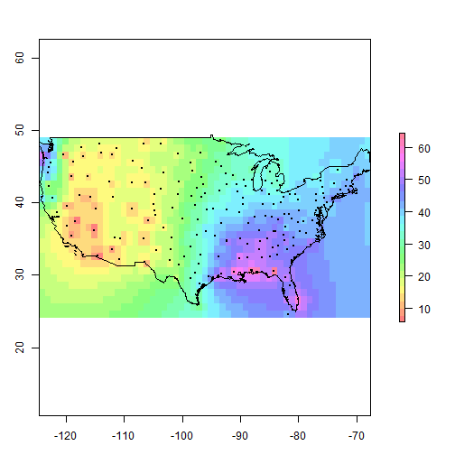

mapGISwithR
===========

R can be a better analytical approach than GIS (and can do most of what GIS does - demo from my class)

The script shows how to read and examine data and also shows analysis examples, such as:

 - simly overlay map (vector & raster data)
 - map projection (reprojection, transformation)
 - thematic mapping (chropleth, dot maps)
 - overlay analysis (what's within what?)
 - distance calculation
 - mean center analysis (replicates John Snow map!)
 - raster interpolation (create annual average weather/rainfall map)
 
  
 
 - and spatial regression model evaluations.. (use of spatial weights)
